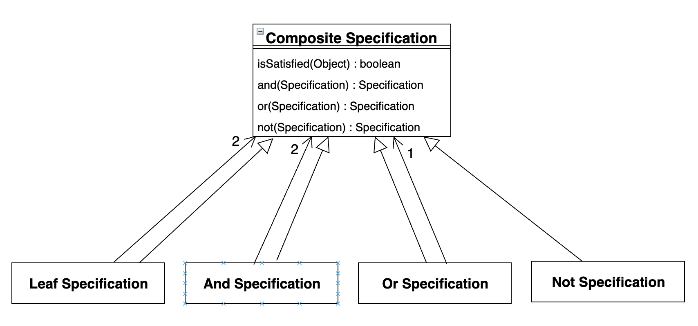

# Chapter 10. 유연한 설계

## Intention-Revealing Interface (의도를 드러내는 인터페이스)

* 개발자가 컴포넌트를 사용하기 위해 컴포넌트의 구현 세부사항을 고려해야 한다면 캡슐화의 가치는 사라진다.
* 도메인 내에 존재하는 개념을 클래스나 메서드의 형태로 명확하게 모델링해서 가치를 얻으려면 해당 도메인 개념을 반영하도록 클래스와 메서드의 이름을 지어야 한다.
* 수행 방법에 관해서는 언급하지 말고 결과와 목적만을 표현하도록 클래스와 연산의 이름을 부여해야 한다.

### Refactoring: 페인트 혼합 애플리케이션

```java
public class Paint {
    private double v;
    private int r;
    private int y;
    private int b;

    public void mixIn(Paint paint) {
        volume = volume + paint.getVolume();
        red = (int) ((red + paint.red) * paint.getVolumn() / volume);
        yellow = (int) ((yellow + paint.yellow) * paint.getVolumn() / volume);
        blue = (int) ((blue + paint.blue) * paint.getVolumn() / volume);
    }

    public double getV() {
        return v;
    }

    public int getR() {
        return r;
    }

    public int getY() {
        return y;
    }

    public int getB() {
        return b;
    }
}
```

위 코드는 고객에게 규격 페인트를 혼합한 결과를 표시해주기 위한 도메인 객체이다. paint(Paint) 메서드가 수행하는 작업을 짐작하는 유일한 방법은 코드를 읽는 방법 뿐이다.

```java
class PaintTest {

    @Test
    void testPaint_1() {
        // 용량이 100인 순수한 노란색 페인트를 생성한다.
        Paint yellow = new Paint(100.0, 0, 50, 0);
        // 용량이 100인 순수한 파란색 페인트를 생성한다.
        Paint blue = new Paint(100.0, 0, 0, 50);

        // 노란색 페인트에 파란색 페인트를 혼합한다.
        yellow.paint(blue);

        // 혼합한 결과는 용량이 200.0인 초록색 페인트여야 한다.
        assertEquals(200.0, yellow.getV(), 0.01);
        assertEquals(25, yellow.getB());
        assertEquals(25, yellow.getY());
        assertEquals(0, yellow.getR());
    }
}
```

위 테스트 코드는 무엇을 수행하고 있는지 잘 나타내지 못한다. Paint 객체를 어떤 식으로 사용하고 싶은지를 반영하게끔 다시 작성하면 아래와 같다.

 ```java
class PaintTest {

    @Test
    void testPaint_2() {
        // 용량이 100인 순수한 노란색 페인트를 생성한다.
        Paint ourPaint = new Paint(100.0, 0, 50, 0);
        // 용량이 100인 순수한 파란색 페인트를 생성한다.
        Paint blue = new Paint(100.0, 0, 0, 50);

        // 노란색 페인트에 파란색 페인트를 혼합한다.
        ourPaint.mixIn(blue);

        // 혼합한 결과는 용량이 200.0인 초록색 페인트여야 한다.
        assertEquals(200.0, ourPaint.getVolume(), 0.01);
        assertEquals(25, ourPaint.getBlue());
        assertEquals(25, ourPaint.getYellow());
        assertEquals(0, ourPaint.getRed());
    }
}
```

 새로운 메서드 이름이 메서드를 읽는 사람에게 Paint를 **혼합한** 결과에 대한 모든 세부사항을 전달할 수는 없지만(이를 위해 Assertion이 필요하다) 클래스를 사용하기에 충분할 정도의 실마리는 제공할 수 있다.
 
- - -

## Side-Effect-Free Function (부수효과가 없는 함수)

 연산은 크게 **명령(command)** 과 **질의(query)** 라는 두 가지 범주로 나뉜다.
* 질의: 변수 안에 저장된 데이터에 접근하거나, 저장된 데이터를 기반으로 계산을 수행해서 시스템으로부터 정보를 얻는 연산
* 명령: 변수의 값을 변경하는 등의 작업을 통해 시스템의 상태를 변경하는 연산

 명령은 시스템의 상태를 변경시키기 때문에 예측하지 못한 부수효과(Side-Effect)가 발생할 가능성이 있다. 부수효과를 일으키지 않으면서 결과를 반환하는 연산을 **함수(Function)** 라고 한다.
 함수는 같은 인자로 여러 번 호출한다면 매번 동일한 값을 반환한다. 따라서 중첩된 깊이에 대해 걱정하지 않고도 다른 함수를 호출할 수 있다.
 
### 명령을 통한 부수효과를 줄이는 방법
1. 명령과 질의를 엄격하게 분리된 서로 다른 연산으로 유지한다.
2. 명령과 질의를 분리하는 대신 연산의 결과를 표현하는 새로운 Value Object를 생성해서 반환한다.

#### Value Object
 Value Object는 불변 객체이며, 오직 Value Obejct를 생성할 때만 호출되는 초기화 연산을 제외한 모든 연산이 함수이다.
 
> 가능한 한 많은 양의 프로그램 로직을 관찰 가능한 부수효과 없이 결과를 반환하는 함수 안에 작성하라.
> 명령(관찰 가능한 상태를 변경하는 메서드)을 도메인 정보를 반환하지 않는 아주 단순한 연산으로 엄격하게 분리하라.
> 한 걸음 더 나아가 책임에 적합한 어떤 개념이 나타나면 복잡한 로직을 Value Object로 옮겨서 부수효과를 통제하라.

### Refactoring: 페인트 혼합 애플리케이션 다시 리팩토링

* 이전의 mixIn() 메서드는 질의로부터 변경을 분리해야 한다는 규칙을 준수하고 있지만 mixIn() 메서드의 인자로 사용되는 paint 객체의 용량이 불확실한 상태로 방치되고 있다.
* 연산이 paint 2의 용량을 변경하지 않는다는 사실은 개념 모델의 문맥상 완벽하게 논리적이라고 할 수 없다.


* 현재 다루고 있는 도메인에서 색상은 중요한 개념이므로 명시적인 객체로 만들 필요가 있다.
* 색상을 mix 하는 행위를 페인트로부터 분리하고, 색상을 불변객체로 만든다.
* 이를 통해 색상이 변경되는 경우, 상태를 변경하는 대신 새로운 색상을 표현하는 객체로 대체된다.


```java
public class PigmentColor {
    private int red;
    private int yellow;
    private int blue;

    public PigmentColor(int red, int yellow, int blue) {
        this.red = red;
        this.yellow = yellow;
        this.blue = blue;
    }

    public PigmentColor mixedWith(PigmentColor color, double ratio) {
        return new PigmentColor(
                (int) ((red + color.red) * ratio),
                (int) ((yellow + color.yellow) * ratio),
                (int) ((blue + color.blue) * ratio)
        );
    }

    public int getRed() {
        return red;
    }

    public int getYellow() {
        return yellow;
    }

    public int getBlue() {
        return blue;
    }
}
```

```java
public class Paint {
    private double volume;
    private PigmentColor pigmentColor;

    public Paint(double volume, PigmentColor pigmentColor) {
        this.volume = volume;
        this.pigmentColor = pigmentColor;
    }

    public void mixIn(Paint other) {
        volume = volume + other.getVolume();
        double ratio = other.getVolume() / volume;
        pigmentColor = pigmentColor.mixedWith(other.pigmentColor, ratio);
    }

    public double getVolume() {
        return volume;
    }

    public int getRed() {
        return pigmentColor.getRed();
    }

    public int getYellow() {
        return pigmentColor.getYellow();
    }

    public int getBlue() {
        return pigmentColor.getBlue();
    }
}
```

 위와 같이 새로운 Pigment Color 클래스는 도메인 내의 지식을 표현하고, 불변적인 특성으로 인해 다른 연산과 결합하거나 단독으로 사용할 때 안정성을 보장받을 수 있다.
 
## Assertion (단언)

* 다수의 위임(delegation)을 포함하는 설계는 이해하기 위해 실행 경로를 따라 추적해야 하므로 캡슐화의 가치가 사라진다.
* "계약에 의한 설계" 에서는 클래스와 메서드에 대해 개발자가 사실임을 보장하는 "단언"을 사용한다.
  * "사후조건"은 연산의 부수효과를 의미하며, 호출되는 연산에서 보장하는 결과를 기술한다.
  * "사전조건"은 계약에 명시된 단서 조항과 유사하며 사후조건이 유효하기 위해 충족돼야 하는 조건들을 기술한다.
* 단언은 절차를 기술하지 않고 상태만 기술하므로 분석하기가 쉽다.

### 다시 페인트 혼합 예제로..

#### Paint 클래스의 mixIn(Paint) 연산에 인자로 전달된 객체의 상태 변화가 모호함

* mixIn(Paint) 메시지를 수신하는 객체의 용량은 인자로 전달된 객체의 용량만큼 증가한다.
* 실생활에서 사용하는 실제 페인트를 떠올려보면 섞이는 다른 쪽 페인트의 용량을 동일한 양만큼 감소시켜 용량을 0으로 만들거나 아니면 객체 자체를 완전히 삭제할 것이다.
* 현재 구현에서는 인자를 변경하지 않지만, 인자를 변경하는 것은 매우 위험한 종류의 부수효과이다.

#### 어플리케이션이 집중해야 하는 부분

* 이전에 개발자들이 페인트의 용량을 변경하지 않기로 한 선택에 대한 이유는 프로그램이 추가된 순수한 페인트의 목록에 관한 보고서를 생성해야 하는 목적이 있었기 때문이었다.
* 진정한 객체 지향은 현실 세계의 사물을 그대로 옮겨오는 것이 아니라 현실의 문제를 추상화하여 객체간의 협력 관계를 소프트웨어 세계에서 재구축 하는 것이다.


```java
class PaintTest {

    @Test
    void testMixingVolume() {
        PigmentColor yellow = new PigmentColor(0, 50, 0);
        PigmentColor blue = new PigmentColor(0, 0, 50);

        StockPaint paint1 = new StockPaint(1.0, yellow);
        StockPaint paint2 = new StockPaint(1.5, blue);
        MixedPaint mix = new MixedPaint();

        mix.mixIn(paint1);
        mix.mixIn(paint2);
        assertEquals(2.5, mix.getVolume(), 0.01);
    }
}
```

- - -

## Conceptual Contour (개념적 윤곽)

* 도메인을 중요 영역을 나누는 것과 관련한 직관을 감안해서 설계 요소를 응집력 있는 단위로 분해하라.
* 계속적인 리팩토링을 토대로 변경되는 부분과 변경되지 않는 부분을 나누는 중심 축을 식별하고, 변경을 분리하기 위한 패턴을 명확하게 표현하는 Conceptual Contour 를 찾아라.
* 목표는 Ubiquitous Language 를 사용해 합리적으로 표현하기 위해 논리적으로 결합할 수 있고 관계없는 선택사항으로 인한 혼란과 유지보수의 보담이 없는 단순한 인터페이스 집합을 얻는 것이다.
* 연속적인 리팩토링이 지역적으로 한정된 범위 안에서만 이뤄지고 넓은 범위의 개념을 흔들지 않는다면 모델이 현재 도메인에 적합해졌다는 표시다.
* 객체와 메서드를 와해시킬 정도로 광범위한 변경을 야기하는 요구사항이 나타났다는 것은 도메인에 관해 알고 있는 지식을 개선해야 한다는 메시지다.

## Standalone Class (독립형 클래스)

* 모든 연관관계는 의존성을 의미한다.
* 응집도가 매우 높은 하위 도메인을 Module 로 만들 경우 일련의 객체를 시스템의 다른 부분으로부터 분리하기 때문에 외부 시스템과 연관된 개념의 수를 제한할 수 있다.
* 낮은 결합도는 객체 설계의 기본 원리이며, 결합도를 낮추기 위해 현재 상황과 무관한 모든 개념을 제거해야 한다.
* 가장 복잡다단한 계산을 Standalone Class 로 도출하려고 노력하라. 이때 Value Object 로 모델링하고 좀더 관계가 밀접한 클래스에서 해당 Value Object 를 참조할 수도 있다.

## Closure Of Operation (연산의 닫힘)

* 닫힘의 특성은 다른 개념의 도입 없이도 연산을 정의하는 수단을 제공한다.
* 주로 Value Object 의 연산을 정의하는 데 주로 사용된다. ex) Pigment Color 는 mixedWith 연산에 대해 닫혀있다.
* 도메인 내에서 Entity 의 생명주기는 매우 중요하므로 연산의 결과로 Entity 를 생성해서 반환할 수는 없다.

## 선언적 설계 (Declarative Design)

 선언적 설계는 대상에 따라 다양한 의미를 지닐 수 있지만 일반적으로 실행 가능한 명세(executable specification)로서 특성(properties)을 매우 정확하게 기술함으로써 소프트웨어를 제어하는 것이다.

#### 논리 연산을 이용한 Specification 조합



Specification 은 확립된 정형화인 술어를 각색한 것이다. 아래와 같이 Specification 을 조합해서 사용하면 복잡한 규칙을 풍부한 표현력으로 작성할 수 있다.

이러한 논리 연산은 술어에 대해 닫혀 있어서 Specification 의 조합은 Closure Of Operation 을 의미한다.

```java
public interface Specification {
    boolean isSatisfiedBy(Object candidate);

    Specification and(Specification other);
    Specification or(Specification other);
    Specification not();
}

public abstract class AbstractSpecification implements Specification {

    @Override
    public Specification and(Specification other) {
        return new AndSpecification(this, other);
    }

    @Override
    public Specification or(Specification other) {
        return new OrSpecification(this, other);
    }

    @Override
    public Specification not() {
        return new NotSpecification(this);
    }
}

public class AndSpecification extends AbstractSpecification {
    private Specification one;
    private Specification other;

    public AndSpecification(Specification x, Specification y) {
        this.one = x;
        this.other = y;
    }

    @Override
    public boolean isSatisfiedBy(Object candidate) {
        return one.isSatisfiedBy(candidate) &&
                other.isSatisfiedBy(candidate);
    }
}

public class OrSpecification extends AbstractSpecification {
    private Specification one;
    private Specification other;

    public OrSpecification(Specification x, Specification y) {
        this.one = x;
        this.other = y;
    }

    @Override
    public boolean isSatisfiedBy(Object candidate) {
        return one.isSatisfiedBy(candidate) ||
                other.isSatisfiedBy(candidate);
    }
}

public class NotSpecification extends AbstractSpecification {
    private Specification wrapped;

    public NotSpecification(Specification x) {
        this.wrapped = x;
    }

    @Override
    public boolean isSatisfiedBy(Object candidate) {
        return !wrapped.isSatisfiedBy(candidate);
    }
}
```

```java
public class ContainerFeature {
    public static ContainerFeature ARMORED = new ContainerFeature("ARMORED");
    public static ContainerFeature VENTILATED = new ContainerFeature("VENTILATED");

    private String code;

    public ContainerFeature(String code) {
        this.code = code;
    }

    @Override
    public boolean equals(Object o) {
        if (this == o) return true;
        if (o == null || getClass() != o.getClass()) return false;
        ContainerFeature that = (ContainerFeature) o;
        return Objects.equals(code, that.code);
    }

    @Override
    public int hashCode() {
        return Objects.hash(code);
    }
}

public class Container {
    private List<ContainerFeature> features;

    public Container() {
        this.features = new ArrayList<>();
    }

    public Container(List<ContainerFeature> features) {
        this.features = features;
    }

    public List<ContainerFeature> getFeatures() {
        return features;
    }
}

public class ContainerSpecification implements Specification {
    private ContainerFeature requiredFeature;

    public ContainerSpecification(ContainerFeature requiredFeature) {
        this.requiredFeature = requiredFeature;
    }

    @Override
    public boolean isSatisfiedBy(Object candidate) {
        if (!(candidate instanceof Container)) {
            return false;
        }
        return ((Container) candidate).getFeatures().contains(requiredFeature);
    }

    @Override
    public Specification and(Specification other) {
        return new AndSpecification(this, other);
    }

    @Override
    public Specification or(Specification other) {
        return new OrSpecification(this, other);
    }

    @Override
    public Specification not() {
        return new NotSpecification(this);
    }
}
```

 휘발성인 동시에 폭발성이 강한 화학 물질인 경우에 두 가지 Specification 을 조합하여 아래와 같이 표현이 가능하다.

```java
class ContainerSpecificationTest {

    @Test
    void specificationTest() {
        Container container = new Container(Arrays.asList(VENTILATED, ARMORED));
        Specification ventilated = new ContainerSpecification(VENTILATED);
        Specification armored = new ContainerSpecification(ARMORED);
        Specification both = ventilated.and(armored);

        assertTrue(both.isSatisfiedBy(container));
    }
}
```
