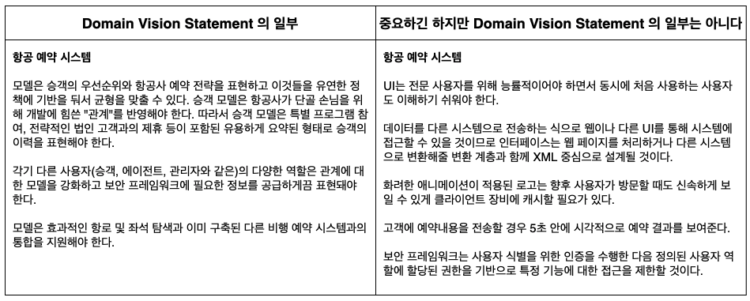
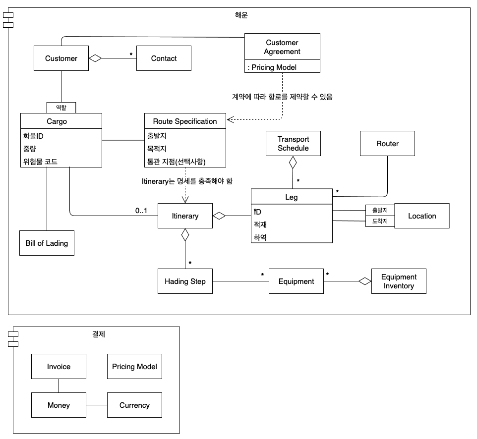
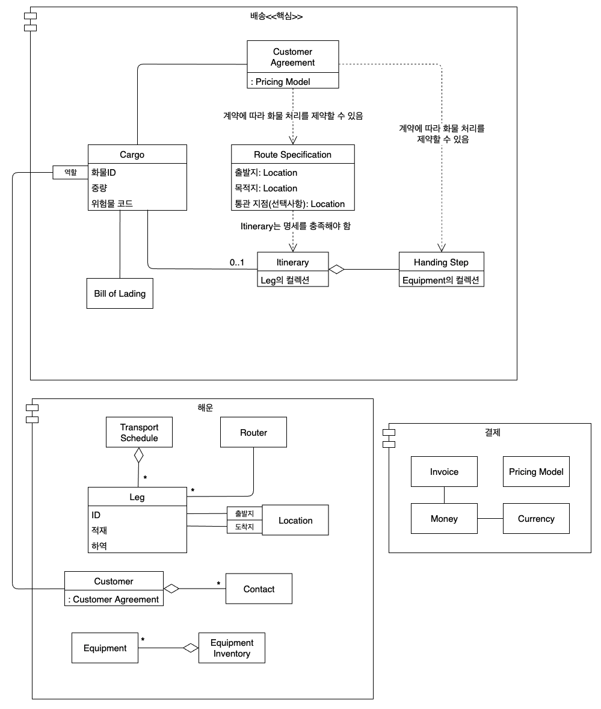
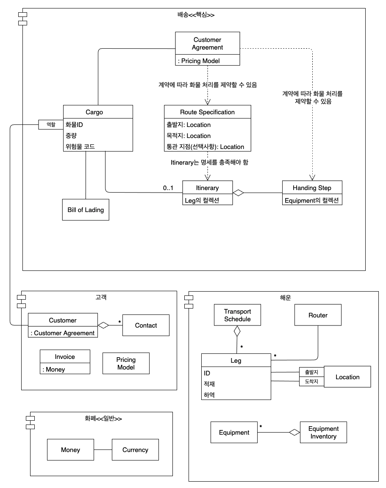

## 디스틸레이션의 단계적 확대

* Domain Vision Statement(도메인 비전 선언문)
  * 최소한의 투자로 기본 개념과 가치를 전달
* Highlighted Core(강조된 핵심)
  * 의사소통을 향상시키고 의사결정을 내리는 데 도움되지만 그럼에도 설계를 거의 수정하지 않거나 아예 수정하지 않아도 됨
* 좀더 적극적인 리팩터링과 재패키지화를 거쳐 명확하게 Generic Subdomain(일반 하위 도메인)을 구분
  * 각 Generic Subdomain 을 개별적으로 다루는 것이 가능해짐
* Cohesive Mechanism(응집력 있는 메커니즘)
  * 용도가 다양하고, 의미전달이 용이하며, 유연한 설계를 통해 캡슐화
  * 부수적인 요소를 제거하여 Core 가 엉키는 것을 방지
* Abstract Core(추상화된 핵심)
  * 가장 근본적인 개념과 관계를 순수한 형태로 표현

위의 각 기법들을 적용하려면 끊임없이 참여하여 도메인 모델의 정수를 추출해야 한다.

- - -

##Generic Subdomain (일반 하위 도메인)

* 모델의 일부는 전문 지식을 포착하거나 전달하지 않고 복잡성을 더함.
* 모델은 일반 원칙이나 세부 사항 탓에 정체된다.
  * 일반 원칙은 누구나 알고 있는 것
  * 세부 사항은 주된 관심사가 아닌 보조적인 역할을 수행하는 전문 분야

### 우리가 집중 해야할 부분
일반적인 모델 요소가 매우 중요한 것으로 여겨지더라도 전체 도메인 모델은 시스템에서 가장 가치를 더하는 특별한 측면을 두드러지게 해야 한다.

* 응집력 있는 하위 도메인을 식별해서 일반화된 모델 요소를 추출하고, 별도 Module 에 배치한다.
* 하위 도메인이 분리되고 나면 해당 하위 도메인의 계속되는 개발에 대해서는 Core Domain 보다 낮은 우선순위를 부여하고 그 일에 핵심 개발자를 배치하지 않는다.
* Generic Subdomain 에 대해서는 기성솔루션이나 공표된 모델을 고려해본다.

### 고려해 볼 수 있는 선택사항

#### 기성 솔루션
이미 구현된 제품을 구입하거나 오픈소스를 활용

**장점**
* 개발할 코드가 적어진다.
* 유지보수 부담이 외부화된다.
* 코드가 좀더 성숙하고 다양한 곳에서 사용되므로 사내에서 개발된 코드에 비해 실수가 적고 완전하다.

**단점**
* 사용하기 전에 평가하고 이해하는 시간이 필요하다.
* 품질관리가 업계에서 이뤄지므로 올바르고 안정적일 거라 확신할 수 없다.
* 용도에 비해 과도하게 만들어져 있을지도 모른다. 최소주의적인 사내 구현에 비해 통합에 드는 노력이 더 클 수도 있다.
* 외부 요소는 대게 매끄럽게 통합되지 않는다.
  * 외부 요소에는 별도의 Bounded Context 가 있을지도 모르고, 그렇지 않더라도 다른 패키지의 Entity 를 자연스럽게 참조하기 쉽지 않을 수 있다.
* 플랫폼 의존성, 컴파일러 버전 의존성 등을 야기할 수도 있다.

#### 공표된 설계나 모델

**장점**
* 사내 모델보다 더 성숙되고 더 많은 사람들의 통찰력을 반영한다.
* 즉각적이고 높은 품질의 문서화

**단점**
* 요구사항에 딱 맞지 않거나 과도한 설계일 수 있다.

분야가 이미 매우 정형화돼 있고 엄밀한 모델이 있을 때는 그것을 사용하면 된다(회계와 물리 분야 등).
이러한 분야는 매우 견고하고 간결할 뿐만 아니라 많은 사람들이 폭넓게 이해하고 있으므로 학습 부담을 덜어준다.
 
#### 외주제작된 구현

**장점**
* 대부분의 지식이 필요하고 축적되는 Core Domain 과 관련된 업무에서 핵심 팀을 해방시켜준다.
* 팀을 영구히 확대하거나 Core Domain 의 지식이 흩어져 없어지지 않고 더욱 많은 개발이 이뤄질 수 있다.
* 명세가 외부로 전달돼야 하므로 인터페이스 중심의 설계가 이뤄지고 하위 도메인을 일반화된 상태로 유지하는 데 도움이 된다.

**단점**
* 인터페이스, 코딩 표준, 다른 모든 중요 측면을 대상으로 의사소통이 필요하므로 여전히 핵심 팀에서 시간을 들여 구현을 살펴봐야 한다.
* 코드를 이해해야 하기 때문에 소유권을 내부로 이전하는 데 상당한 부담이 야기된다.
* 두 팀의 상대적 역량에 따라 코드의 품질이 좋거나 나쁠 수 있다.

품질 수준을 보증하는 것을 돕고 명세를 명확하게 하고 재통합을 매끄럽게 하는 효과적인 접근법은 위주 제작되는 컴포넌트에 대한 자동화된 인수 테스트를 명시하는 것이다.
"외주 제작된 구현"은 "공표된 설계나 모델"과 아주 잘 어울릴 수 있다.
 
#### 사내 구현

**장점**
* 통합하기 쉬움
* 정확히 원하는 것만을 얻음
* 임시 계약자를 할당할 수 있음

**단점**
* 계속되는 유지보수와 교육 부담
* 패키지 개발에 필요한 시간과 비용을 과소평가하기 쉬움

"사내 구현"도 "공표된 설계나 모델"과 잘 어울린다.
 
Generic Subdomain 은 외부 설계 전문가를 적용해 볼 수 있는 분야다. Generic Subdomain 에서는 특화된 Core Domain 을 심층적으로 이해하지 않아도
되기 때문이다.

### 일반화가 재사용 가능하다는 의미는 아니다

* 디스틸레이션은 Core Domain 에 가능한 한 많은 노력을 기울이고 보조적인 성격의 Generic Subdomain 에는 필요한 만큼만 투자해야 한다.
* 재사용이 일어나긴 해도 그것이 항상 코드 재사용에 해당하는건 아니다. 완벽한 일반성을 갖춘 모델을 개발하려고 시간과 노력을 들이려고 하지 말아야 한다. 당면한 업무에 필요한 부분에 대해서만 모델링하고 구현해도 된다.
* 재사용을 목표로 설계할 일은 거의 없더라도 일반 개념의 범위 내에서 설계를 유지하는 것과 관련해서는 엄격해야 한다.

### 프로젝트 위험 관리

Core Domain 모델링은 종종 예상외로 쉽지 않고, Core Domain 없이는 프로젝트가 성공할 수 없으므로 위험도가 높다. 프로젝트는 이러한 업무를 먼저 다루어
시간과 노력을 쏟아서 Core Domain 의 정수를 추출해야 한다. 

두 패턴인 Domain Vision Statement 와 Highlight Core 는 보조적인 성격의 문서를 활용하여 Core 에 대한 의사소통과 인식을 개선하고 개발 노력에 집중하게 해준다.

- - -

## Domain Vision Statement (도메인 비전 선언문)

Domain Vision Statement 는 도메인 모델의 본질과 해당 도메인 모델이 얼마나 기업에 가치 있는가에 초점을 맞춘다.

Domain Vision Statement 는 모델과 코드 자체의 디스틸레이션 과정에서 개발팀을 줄곧 공통적인 방향으로 향하게 할 이정표로 사용될 수 있다. 비기술 관련 팀원,
관리조직, 심지어 고객과도 공유할 수 있다.

#### 도메인 비전 선언문 작성 방법
* 약 한 페이지 분량으로 Core Domain 을 짧게 기술하고 그것이 가져올 가치에 해당하는 "가치 제안"을 작성해야 한다.
* 도메인 모델과 다른 것과 구별하는 데 도움되지 않는 측면은 무시하라.
* 도메인 모델이 어떻게 다양한 관심사를 충족하고 균형을 이루는지 보여라.
* 한정된 범위에서 내용을 유지하고, 새로운 통찰력을 얻을 때마다 선언문을 개정하라.

#### 예시

Domain Vision Statement 는 팀 내에서 방향성을 공유하게 만들어준다.

고수준의 Statement 와 코드 또는 모델의 세부사항 사이에는 대개 일정 수준의 중개 역할이 필요하다.

- - -

## Highlighted Core (강조된 핵심)

Domain Vision Statement 에서는 대체로 Core Domain 을 파악하지만 특정 Core 모델의 구성요소를 식별하는 것은 전혀 예측할 수 없는 개별 해석의 몫으로
남는다. 그러므로 모든 사람이 Core Domain 을 쉽게 알 수 있도록 모델에 대해 중요한 부분을 강조해야 한다. 대표적으로 다음과 같은 기법으로 이러한 종류의 해법을
대표한다.

### 디스틸레이션 문서

Core Domain 과 Core 의 구성요소 사이에서 일어나는 상호작용을 기술한다. 디스틸레이션 문서는 완전한 설계 문서가 아니며, 최소주의적인 진입점으로서 Core 의
윤곽을 드러내고 설명하며, 특정 부분을 좀더 면밀하게 조사하는 이유를 제기한다.

디스틸레이션 문서는 관리되지 않거나, 아무도 읽지 않거나, 정보의 출처가 늘어남으로써 점점 복잡해질지 모르는 위험을 방지하기 위해서 절대적으로 최소주의를 지향해야 한다.

### 표시된 Core

Highlighted Core 를 나타내기 위해 특정한 형식의 문서가 강요되는 것은 아니다. UML 다이어그램 내에서 강조할 수도 있고, Java Doc 또는 개발 환경에서
제공하는 도구를 이용할 수도 있다.

모델의 주요 저장소 안에 있는 Core Domain 의 구성요소에 대해 그것의 역할을 설명하려 하지 않고 표시하는 것만으로도 개발자가 힘들이지 않고 Core 의 안과 밖을
알 수 있다.

- - -

## Cohesive Mechanism (응집력 있는 메커니즘)

메커니즘을 캡슐화하는 것은 객체지향 설계의 표준 원칙이다. Cohesive Mechanism 은 캡슐화를 통해 의도를 드러내는 이름이 지정된 메서드에 복잡한 알고리즘을 숨겨서
"What"과 "How"를 분리하는 것이다.

때때로 계산은 설계를 부풀리기 시작하는 수준의 복잡성에 이르기도 한다. 개념적인 "무엇"이 기계적인 "어떻게" 탓에 복잡성이 커지는 것이다. 이 기계적인 메커니즘(How)을
별도의 경량 프레임워크로 분할하고 위임함으로써 문제(What)를 표현하는 데 더 집중할 수 있다.

#### 예시

Cohesive Mechanism 의 예로 Specification 객체를 구성하고 기본적인 비교 및 조합 연산을 지원하는 프레임워크가 있다. 이러한 프레임워크를 활용함으로써
Core Domain 과 Generic Subdomain 에서는 Specification 을 해당 패턴에 기술된 명료하고 손쉽게 이해할 수 있는 언어로 선언할 수 있다.

### Generic Subdomain 과 Cohesive Mechanism

Generic Subdomain 과 Cohesive Mechanism 모두 똑같이 Core Domain 의 부담을 더는 데 목적이 있다. 

Generic Subdomain 은 팀이 도메인을 어떻게 바라보는지와 관련된 일부 측면을 나타내는 표현력 있는 모델에 토대를 둔다. 이런 점에서 Generic Subdomain 은
단지 덜 중심적이고, 덜 중요하며, 덜 특화됐다는 점을 제외하면 Core Domain 과 전혀 다르지 않다.

Cohesive Mechanism 은 도메인을 나타내지 않는다. Cohesive Mechanism 은 표현력 있는 모델에서 제기하는 일부 복잡한 계산 문제를 해결해줄 뿐이다.

- - -

## Segregated Core (분리된 핵심)

Core 요소들이 일반화되고 보조적인 역할을 수행하는 Generic Subdomain 과 얽힌 채로 남겨지지 않도록 분리해야 한다. 이를 통해 Core Domain 의 응집력을
강화해야 한다.

#### Segregated Core 로 리팩토링하는 단계

1. Core 하위 도메인을 식별한다(디스틸레이션 문서에서 도출해야 할 수도 있음).
2. 새로운 Module 로 관련 클래스를 옮긴다. 이때 Module 의 이름은 관련 개념에 따라 짓는다.
3. 개념을 직접적으로 표현하지 않는 서버 데이터와 기능으로 코드를 리팩토링한다. 제거된 측면을 다른 패키지에 있는 클래스에 배치한다.
4. 새로 생긴 Segregated Core Module 의 관계와 상호작용을 더욱 단순하고 전달력 있게 만들고, 다른 Module 과의 관계가 최소화되고 분명해지게끔 리팩토링한다.
5. Segregated Core 가 완전해질 때 까지 또 다른 Core 하위 도메인을 대상으로 위 단계를 반복한다.

#### 예제

해운 모델의 본질은 영업부서를 위한 것이 아닌, 고객 요구에 따른 화물 인도이다. 따라서 화폐와 관련된 문제는 모조리 보조적인 역할로 분류해야 한다.

결제 관련 항목은 이미 별도 패키지로 배치되어 있고, 화물을 배송하는 것과 직접적으로 관련된 클래스들을 추출하면 아래와 같이 배송이라는 새로운 패키지에
Segregated Core 가 생긴다.

Customer Agreement(고객 계약) 객체가 지금은 Handling Step(처리 단계) 객체를 제약한다.

Customer 객체를 거쳐 Customer Agreement 객체를 탐색하기 보다 직접적으로 Customer Agreement 객체가 Cargo 객체에 배속된다. 새로운 연관관계 덕분에
Customer 를 Core 로부터 뽑아내기 쉬워진다.

더 의사소통이 원활한 패키지화를 위해 아래와 같이 리팩토링을 계속해 나갈 수 있다.

리팩토링은 여러 번에 걸쳐 필요할지도 모르지만 한꺼번에 리팩토링을 할 필요는 없다.

## Abstract Core (추상화된 핵심)

다형성에는 추상 타입의 여러 인스턴스 간에 존재하는 갖가지 세부적인 차이를 무시할 수 있다는 장점이 있다. 여러 Module 간의 상호작용을 대부분 다형적인 인터페이스
수준에서 표현할 수 있다면 이러한 타입을 특별한 Core Module 로 리팩토링하는 편이 바람직할 수도 있다.

모델의 가장 근본적인 개념을 식별해서 그것을 별도의 클래스나 추상 클래스, 또는 인터페이스로 추출하고, 이 추상 모델이 중요 컴포넌트 간에 발생하는 상호작용을
대부분 표현할 수 있게끔 설계해야 하고, 특화되고 세부적인 구현 클래스는 하위 도메인을 기준으로 정의된 자체적인 Module 에 남겨둔 상태에서 이 추상적이면서
전체적인 모델을 자체적인 Module 에 배치해야 한다.

