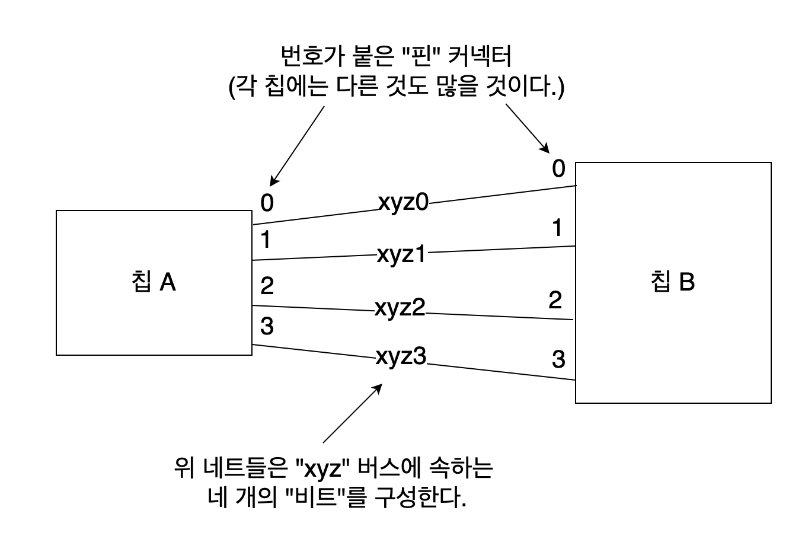
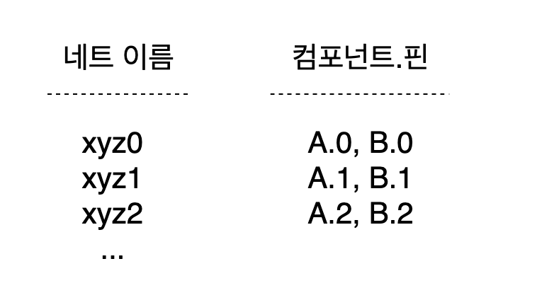
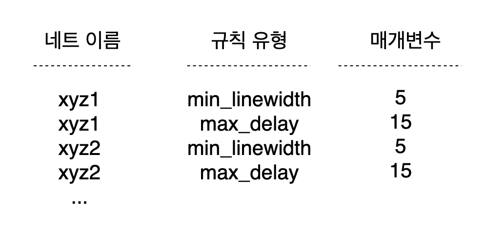
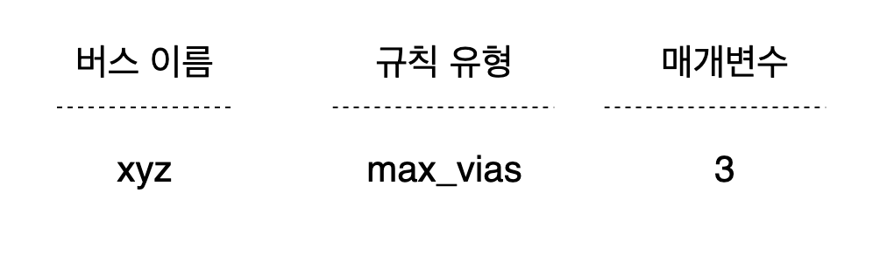
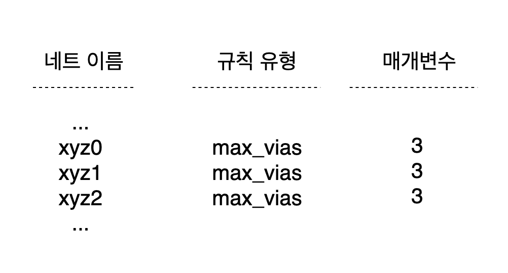
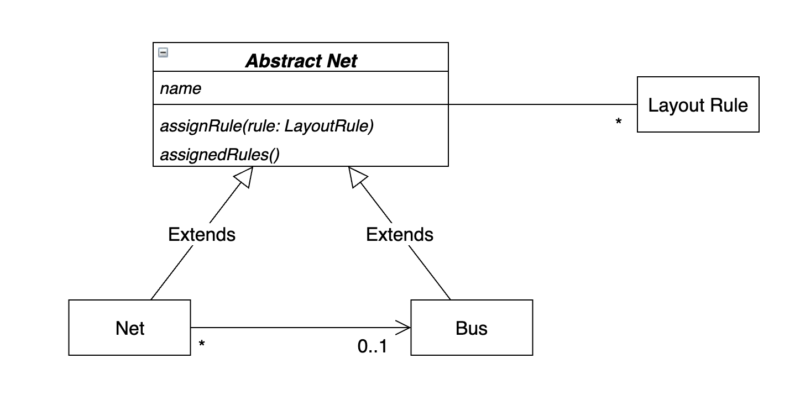

## 분석 모델

 분석 모델은 설계와 뚜렷이 구분한다. 소프트웨어 시스템에서 수행할 역할에 대해서는 고려하지 않은 채 업무 도메인의 개념만을 체계화하고자 한다.
 
## 구현의 문제

 * 앞서 말한 도메인 모델과 분석 모델은 분석 단계 동안은 어느 정도 지식 탐구가 일어나긴 한다. 
 * 하지만 분석 모델은 개발자가 설계를 하귀 위해 새롭게 추상화를 생각해내야 할 때 지식 탐구의 성과 중 대부분이 사라진다.
 * 결과적으로 순수하게 이론에만 치우친 분석 모델은 개발이 시작되자마자 폐기되고 대부분의 문제를 다시 검토해야 한다.
 
## 도메인 모델

 * 도메인 모델은 양쪽 모두의 목적을 달성하는 단일 모델을 찾기 위해 분석 모델과 설계를 나누는 이분법은 사용하지 않는다.
 * 순수하게 기술적인 쟁점은 배제함으로써 설계상의 각 객체는 모델에서 기술한 개념적 역할을 수행하게 된다. 
 * 모델이 구현에 대해 비현실적으로 보이거나 도메인의 핵심 개념을 충실하게 표현하지 않을 때 새로운 모델을 찾아내야 한다.
 
## Ubiquitous Language

 * 도메인 모델을 설계할 때 설계와 모델의 대응을 분명하게 하면 코드를 통해 해당 소프트웨어 시스템에 기대하는 동작을 충분히 설명할 수 있다.
 * 새롭게 학습된 지식을 통해 코드가 변화하면 그것이 곧 모델의 변경으로 이어질 수 있다.

---

## 모델링 패러다임과 도구 지원

 * 절차지향적인 언어는 컴퓨터가 수행해야할 일련의 절차상의 단계를 표현할 수 있지만, 함수 이상의 고수준의 의미를 담을 방법이 없다.
 * 대부분의 문제는 수학적이지 않는 도메인 문제이며, 이를 위한 패러다임으로는 객체지향 설계 접근법이 용이하다.

### 예제

#### 인쇄 회로 기판(PCB)

 * 인쇄 회로 기판은 다수의 **컴포넌트** 의 **핀** 을 연결하는 **전도체(네트)** 의 집합으로 볼 수 있다.
 * 수천 개의 네트 각각이 고유의 **레이아웃 규칙** 을 지니고 있다.
 * 특정 그룹에 속하는 여러 네트가 서로 동일한 규칙을 공유해야 한다.
 * 여러 개의 네트를 집합은 **버스** 로 묶는다.
 * 규칙은 수만 개의 네트에 한 번에 하나씩 할당돼야 한다.

#### 기계적인 설계

 * 네트 목록 파일

   

 * 레이아웃 규칙

   
1. 네트 이름으로 네트 목록 파일을 정렬한다.
2. 버스 이름 패턴으로 시작하는 첫 번째 네트를 찾으면서 파일의 각 줄을 읽는다.
3. 이름이 일치하는 각 줄에서 해당 줄을 파싱해서 네트의 이름을 구한다.
4. 규칙 테스트가 있는 네트 이름을 규칙 파일에 추가한다.
5. 나머지 줄이 더는 버스 이름과 일치하지 않을 때까지 3번 과정부터 반복한다.

 위 과정을 통해 버스 규칙을 아래와 같이 입력하면

 다음과 같이 네트 규칙이 추가된다.

#### 모델 주도 설계

[예제 코드](https://github.com/icarus8050/ObjectPractice/tree/master/pcb/src)

 위와 같이 모델 주도로 설계를 하게 되면 테스트하기가 용이해진다. 컴포넌트에서는 손쉽게 단위 테스트 할 수 있는 인터페이스를 제공하게 된다.
 
 이러한 설계는 한 번에 나타나는 것이 아니다. 도메인의 중요한 개념만 추출해서 간결하고 예리한 모델로 표현하려면 리팩터링과 지식 탐구의 과정을 수차례에 걸
 쳐 반복해야 함을 반드시 기억해야 한다.

---
