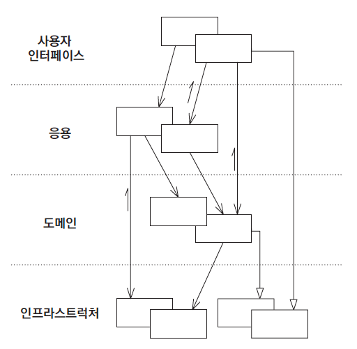

## 분석 모델

 분석 모델은 설계와 뚜렷이 구분한다. 소프트웨어 시스템에서 수행할 역할에 대해서는 고려하지 않은 채 업무 도메인의 개념만을 체계화하고자 한다.
 
## 구현의 문제

 * 앞서 말한 도메인 모델과 분석 모델은 분석 단계 동안은 어느 정도 지식 탐구가 일어나긴 한다. 
 * 하지만 분석 모델은 개발자가 설계를 하귀 위해 새롭게 추상화를 생각해내야 할 때 지식 탐구의 성과 중 대부분이 사라진다.
 * 결과적으로 순수하게 이론에만 치우친 분석 모델은 개발이 시작되자마자 폐기되고 대부분의 문제를 다시 검토해야 한다.
 
## 도메인 모델

 * 도메인 모델은 양쪽 모두의 목적을 달성하는 단일 모델을 찾기 위해 분석 모델과 설계를 나누는 이분법은 사용하지 않는다.
 * 순수하게 기술적인 쟁점은 배제함으로써 설계상의 각 객체는 모델에서 기술한 개념적 역할을 수행하게 된다. 
 * 모델이 구현에 대해 비현실적으로 보이거나 도메인의 핵심 개념을 충실하게 표현하지 않을 때 새로운 모델을 찾아내야 한다.
 
## Ubiquitous Language

 * 도메인 모델을 설계할 때 설계와 모델의 대응을 분명하게 하면 코드를 통해 해당 소프트웨어 시스템에 기대하는 동작을 충분히 설명할 수 있다.
 * 새롭게 학습된 지식을 통해 코드가 변화하면 그것이 곧 모델의 변경으로 이어질 수 있다.

---

## 모델링 패러다임과 도구 지원

 * 절차지향적인 언어는 컴퓨터가 수행해야할 일련의 절차상의 단계를 표현할 수 있지만, 함수 이상의 고수준의 의미를 담을 방법이 없다.
 * 대부분의 문제는 수학적이지 않는 도메인 문제이며, 이를 위한 패러다임으로는 객체지향 설계 접근법이 용이하다.

### 예제

#### 인쇄 회로 기판(PCB)

 * 인쇄 회로 기판은 다수의 **컴포넌트** 의 **핀** 을 연결하는 **전도체(네트)** 의 집합으로 볼 수 있다.
 * 수천 개의 네트 각각이 고유의 **레이아웃 규칙** 을 지니고 있다.
 * 특정 그룹에 속하는 여러 네트가 서로 동일한 규칙을 공유해야 한다.
 * 여러 개의 네트를 집합은 **버스** 로 묶는다.
 * 규칙은 수만 개의 네트에 한 번에 하나씩 할당돼야 한다.

#### 기계적인 설계

 * 네트 목록 파일

 * 레이아웃 규칙

   
1. 네트 이름으로 네트 목록 파일을 정렬한다.
2. 버스 이름 패턴으로 시작하는 첫 번째 네트를 찾으면서 파일의 각 줄을 읽는다.
3. 이름이 일치하는 각 줄에서 해당 줄을 파싱해서 네트의 이름을 구한다.
4. 규칙 테스트가 있는 네트 이름을 규칙 파일에 추가한다.
5. 나머지 줄이 더는 버스 이름과 일치하지 않을 때까지 3번 과정부터 반복한다.

 위 과정을 통해 버스 규칙을 아래와 같이 입력하면

 다음과 같이 네트 규칙이 추가된다.

#### 모델 주도 설계

[예제 코드](https://github.com/icarus8050/ObjectPractice/tree/master/pcb/src)

 위와 같이 모델 주도로 설계를 하게 되면 테스트하기가 용이해진다. 컴포넌트에서는 손쉽게 단위 테스트 할 수 있는 인터페이스를 제공하게 된다.
 
 이러한 설계는 한 번에 나타나는 것이 아니다. 도메인의 중요한 개념만 추출해서 간결하고 예리한 모델로 표현하려면 리팩터링과 지식 탐구의 과정을 수차례에 걸
 쳐 반복해야 함을 반드시 기억해야 한다.

---

## 도메인의 격리

 * 시스템에서 도메인과 관련이 적은 기능으로부터 도메인 객체를 분리해야 한다.
 * 위를 통해서 도메인 개념을 다른 소프트웨어 기술에만 관련된 개념과 혼동하거나, 시스템이라는 하나의 큰 덩어리 안에서 도메인을 전혀 바라보지 못하는 문제를 방지할 수 있다.

## Layered Architecture (계층형 아키텍쳐)

 * 비즈니스 객체 안에 사용자 인터페이스, 데이터베이스, 기타 보조적인 성격의 코드를 직접 작성하는 것은 단기적으로는 쉬운 방법이다.
 * 하지만 도메인에 관련 없는 다른 코드들이 많아질수록 도메인에 관련된 코드를 확인하고 추론하기 어려워진다.
 * 계층화의 핵심 원칙은 한 계층의 모든 요소는 오직 같은 계증에 존재하는 다른 요소나 계층상 **아래** 에 위치한 요소에만 의존해야 한다.

### 네 가지 개념적 계층

#### 사용자 인터페이스 (또는 표현 계층)

 사용자에게 정보를 보여주고 사용자의 명령을 해석하는 일을 책임진다. 사람이 아닌 다른 시스템이 외부 행위자가 되기도 한다.

#### 응용 계층

 소프트웨어가 수행할 작업을 정의하고 표현력 있는 도메인 객체가 문제를 해결하게 한다. 이 계층에는 업무 규칙이나 지식이 포함되지 않으며, 오직 작업을 조정하고 아래에 위치한 계층에 포함된 도메인 객체의 협력자에게 작업을 위임한다.
 
#### 도메인 계층 (또는 모델 계층)

 업무 개념과 업무 상황에 관한 정보, 업무 규칙을 표현하는 일을 책임진다. 상태 저장과 관련된 기술적인 세부사항은 인프라스트럭처에 위임한다.

#### 인프라스트럭처 계층

 상위 계층을 지원하는 일반화된 기술적 기능을 제공한다.이러한 기능에는 애플리케이션에 대한 메시지 전송, 도메인 영속화, UI에 위젯을 그리는 것 등이 있다.
 
### 계층간 분리

 * 응집력 있고 오직 아래에 위치한 계층에만 의존하는 각 계층에서 설계를 발전시켜라.
 * 상위 계층과의 결합을 느슨하게 유지하라.
 * 도메인 모델과 관련된 코드는 모두 한 계층에 모으고 사용자 인터페이스 코드나 애플리케이션 코드, 인프라스트럭쳐 코드와 격리하라.
 * 분리의 주된 이점은 애플리케이션 계층이 단순해져서 애플리케이션 본연의 책임에만 집중하게 되는 것이며, 이로써 메시지를 **"언제"** 보내는지 알아도 **"어떻게"** 보내는지는 알 필요가 없어진다.

## 아키텍쳐 프레임워크

 * 인프라스트럭쳐가 인터페이스를 통해 호출되는 Service의 형태로 제공된다면 계층화의 동작 방식과 각 계층이 느슨하게 결합되는 방식은 상당히 직관적이다.
 * 일부 기술적인 문제에는 더욱 침습적인 형태의 인프라스트럭쳐가 필요하기도 하다.
 * 가장 바람직한 아키텍처 프레임워크라면 도메인 개발자가 모델을 표현하는 것에만 집중하게 해서 복잡한 기술적 난제를 해결한다.
 * 프레임워크에서 도메인 설계와 관련된 의사결정을 제약하는 가정을 너무 많이 만들어내거나 구현을 너무 과중하게 만들어 개발을 더디게 하는 경우가 있다.
 * 한 프레임워크를 이용해 해결하기 힘든 갖가지 측면은 어려운 문제를 해결하고자 어디서든 통하는 일률적인 해법을 모색하는 것이 아니라 여러 프레임워크를 선택적으로 적용해서 극복할 수 있다.

## Smart UI(지능형 UI) 안티패턴

#### 장점

 * 업무 로직을 사용자 인터페이스에 넣기 때문에 애플리케이션이 단순한 경우 생산성이 높고 효과가 즉각적으로 나타난다.
 * 다소 능력이 부족한 개발자도 약간의 교육으로 이러한 방식으로 업무를 진행할 수 있다.
 * 요구사항 분석 단계에서 결함이 발생하더라도 사용자에게 프로토타입을 배포한 후 요구에 맞게 제품을 변경해서 문제를 해결할 수 있다.

#### 단점

 * 데이터베이스를 이용하는 방식 말고는 여러 애플리케이션을 통합하기가 수월하지 않다.
 * 행위를 재사용하지 않으며 업무 문제에 대한 추상화가 이뤄지지 않는다.
 * 추상화의 부재로 리팩토링의 여지가 제한된다.

### Smart UI와 Layered Architecture 사이의 중간 해법, 트랜잭션 스크립트

 * 트랜잭션 스크립트는 애플리케이션으로부터 UI를 분리해내지만 객체에 모델을 제공하지는 않는다.