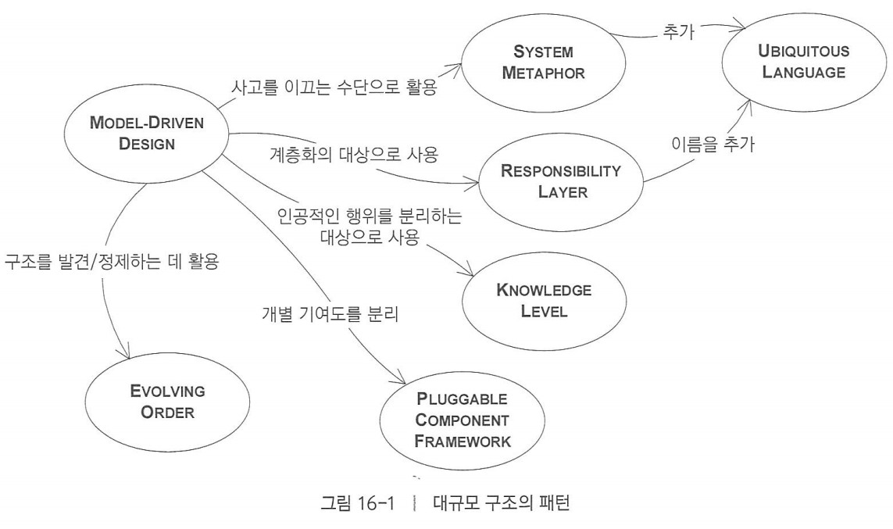
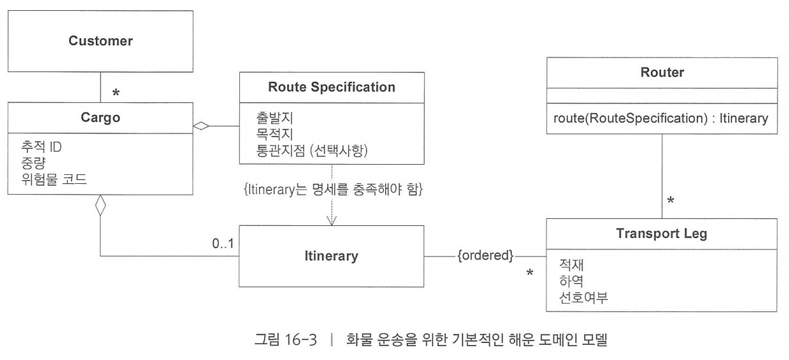
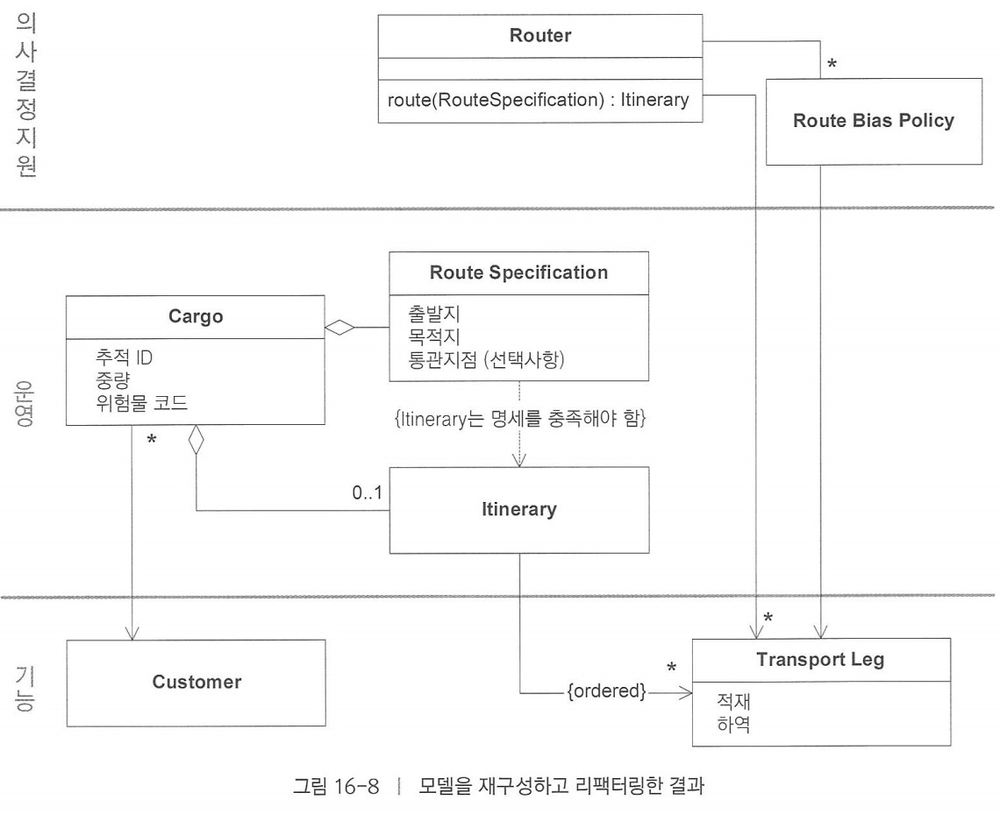
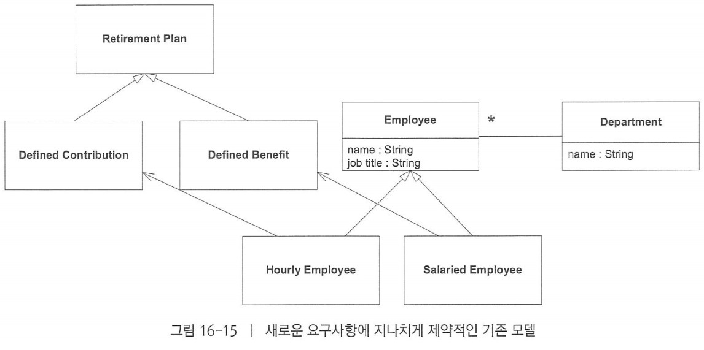
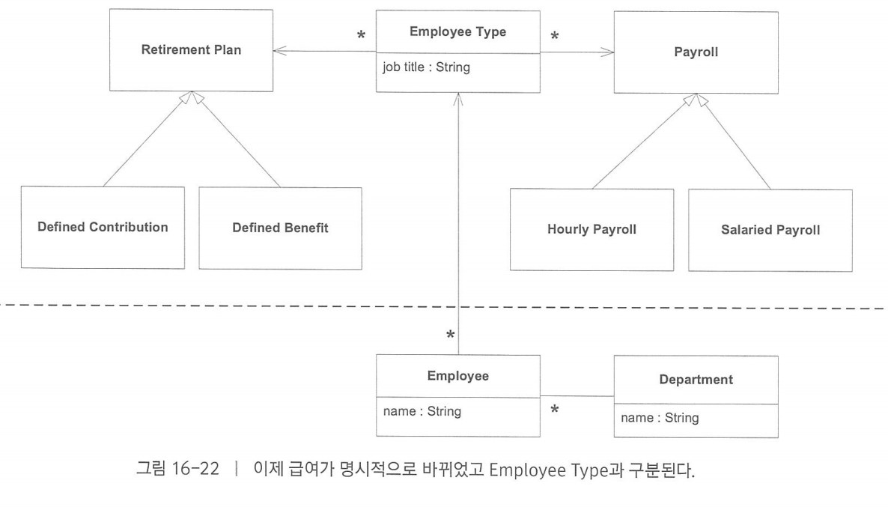

> 지난 시간의 이야기 
> - 대규모 구조: 설계를 이해하고 조작할 수 있게 구성하는 방법
>   - 발전하는 질서: 세부적인 설계 및 모델과 관련된 의사결정을 과도하게 제약하지 않음으로써 새로운 구조를 발견, 정제해 나가기  
>   - 시스템 은유: 전체적인 시스템을 바라보는 시각을 공유할 구체적인 수단
> 
> 

# 책임 계층

> 사견으로, `책임 계층` 보다 `책임의 계층화` 혹은 `계층화된 책임`이 더 어울리지 않을까 생각한다.

##책임 주도 설계

객체별로 할당된 책임의 범위를 더 큰 규모로 확장한다.  
큰 모델에서는 책임을 할당하는데에있어 특정한 구조를 도입하여 응집력을 부여할 수 있다.

## 계층

시스템의 구획, 각 구획의 구성요소는 "아래에 있는" 계층의 서비스는 알고 이용할 수 있지만 "위에 있는" 계층은 알지 못하고 독립적으로 존재한다. 
👉 의존 관계는 위에서 아래 방향으로 존재해야한다.

## 책임 계층 패턴 적용

1. 도메인에서 나타나는 자연적인 층을 식별하고 광범위한 추상적 책임으로 간주한다.

2. 각각의 층을 계층으로 분리하고, 계층마다 책임을 부여하여 책임에 맞게 리팩토링한다.

> 도메인에서 나타나는 층은 개념적 의존성, 변화의 근원, 도메인의 여러 부분에 대한 다양한 변화율을 검토함으로서 나타날 수 있다.

## 적절한 계층의 선택

계층이 바뀌고 병합되고 나뉘고 재정의될 때 찾아서 지켜야할 몇가지 유용한 특징:

- **스토리텔링**
  - 계층은 도메인의 기본적인 실제 상황과 우선순위를 전해줘야한다. (계층은 업무의 우선순위를 드러내야한다.)
- **개념적 의존성**
  - `상위 계층`에 있는 개념은 `하위 계층`을 배경으로하는 의미를 지니고, 동시에 `하위 계층`의 개념은 독자적인 의미를 지녀야한다.
- **개념적 윤곽(CONCEPTUAL CONTOUR)**
  - 다양한 계층에 놓인 객체들이 변화율이나 변화의 근원이 서로 다르다면 계층은 객체간에 구획을 짓는일에 일조한다.

### 대부분의 도메인에서 나타날 수 있는 계층

**잠재 기능 계층**: `무엇을 할 수 있는가?`

**운영 계층**: `무엇이 행해지는가?`

**의사결정 지원 계층**: `어떤 행동을 취하고 어떤 정책을 수립해야하는가?`

**정책 계층**: `규칙과 목표는 무엇인가?`

## 예시 - 해운 시스템

---

# 지식 수준 (KNOWLEDGE LEVEL)

앱의 운영적 책임을 수행하는 `기반 수준(base level)`과 소프트웨어 구조와 행위에 대한 지식을 나타내는 `메타 수준(meta level)`을 분리한다.

운영에서 사용되는 `기반 수준 모델`에서 자기규정적인 측면을 `메타 수준 모델`로 분리한다. 
이를 통해, `기반 수준 모델`의 제약사항은 `메타 수준 모델`을 통해 명시적으로 나타난다.

지식 수준은 두 가지의 유용한 구분법을 제공한다:

1. 앱의 도메인에 초점을 맞춰 구분법을 제공한다.
2. 완전한 보편성을 달성하려고 애쓰지 않는다.

기본적인 모델의 구조와 행위를 설술하고 제약하는데 사용하는 별도의 객체 집합을 두 가지 수준으로 분리하여 만든다:

1. 하나는 매우 구체적으로 만들고
2. 다른 하나는 사용자나 관리자의 맞춤화가 가능한 규칙과 지식을 반영한다.

## 예시 - 직원 급여와 연금

# 착탈식 컴포넌트 프레임워크 (PLUGGABLE COMPONENT FRAMEWORK)

## 필요성

모두 같은 추상화에 의존하지만, 서로 독립적으로 설계되어있는 애플리케이션간 상호운영해야할 때,

- 여러 제한된 컨텍스트 사이의 번역 때문에 통합이 제한된다.
- 공유된 커널은 서로 긴밀하게 일하지 않는 팀에는 맞지않다.

이로인한 중복과 단편화는 개발과 설치 비용을 높이고 상호운용성은 달성하기 어려워진다.

## 패턴의 적용

인터페이스와 상호작용에 대한 추상 코어(ABSTRACT CORE)를 정제하고 그러한 인터페이스의 다양한 구현이 자유롭게 대체될 수 있는 프레임워크를 만들어라.
이와 같이 구현된 컴포넌트는 추상 코어의 인터페이스를 통해 동작하는 어떠한 앱에서도 사용할 수 있어야한다.

## 착탈식 컴포넌트 프레임워크의 불리한점

1. 패턴 적용이 힘들다.
2. 앱에서 선택의 여지가 제한된다. (심층적인 통찰력으로 향하는 리팩터링이 거의 멈추게된다.)

# 구조는 얼마나 제약성을 지녀야하는가?

**각 구조적 규칙은 개발을 용이하게 해야한다.**

# 잘 맞아떨어지는 구조를 향한 리팩터링

비용을 통제하고 이익을 극대화하는 몇 가지 일반적인 방법:

### 최소주의

가장 중요한 관심사만 다루고 나머지는 사례별로 처리한다. 초반에는 시스템 은유나 몇 가지 책임 계층과 같은 느슨한 구조를 택한다.

### 의사소통과 자기 훈련

새로운 개발과 리팩터링시 반드시 구조를 따라야한다. 또한 팀원 전체가 구조를 이해하고 유비쿼터스 언어에 포함되어야한다.
느슨한 개념적 지침을 따르도록 자기훈련을 해야한다. 

### 재구조화가 유연한 설계를 낳는다

구조는 시스템의 복합성이 증가하고 이해가 깊어질수록 발전한다. 따라서 구조가 바뀔 때마다 전체 시스템은 새로운 질서를 따르도록 바뀌어야한다.
이를 통해 안정적인 측면은 단순화되고, 변화의 중심축이 식별되어 유연해질 수 있다.

### 디스틸레이션은 부하를 줄인다.

지속적인 디스틸레이션은 다양한 방식으로 구조 변경의 어려움을 덜어준다.

---

# 17. 전략의 종합

## 패턴간의 결합

전략적 설계의 세 가지 기본 원칙(컨텍스트, 디스틸레이션, 대규모 구조)은 서로 대체 가능하지 않다. 이들은 서로 보완하며 상호작용 한다.

- 대규모 구조는 하나의 제한된 컨텍스트에만 존재하거나 여러 제한된 컨텍스트에 존재하면서 컨텍스트 맵을 구성할 수 있다.
- 대규모 구조 자체가 코어 도메인의 중요한 부분이 될 수 있다.

## 평가하기

프로젝트에 대한 전략적 설계를 다룰 때는 현 상황을 명확하게 평가하는 일부터 시작해야한다:

1. 컨텍스트 맵을 그린다. 일관된 컨텍스트 맵을 그릴 수 있는지, 모호한 상황은 없는지 평가한다.
2. 프로젝트상의 언어를 쓴다. 유비쿼터스 언어가 있는지, 또한 개발에 도움을 줄 만큼 풍부한지 평가한다.
3. 무엇이 중요한지 이해한다. 코어 도메인이 식별되었는지, 도메인 비전 선언문이 있는지 혹은 작성할 수 있는지 평가한다.
4. 프로젝트에 사용하는 기술이 모델 기반 디자인에 유리한지 불리한지 평가한다.
5. 팀 내 개발자가 필요한 기술 역량을 갖췄는지 평가한다.
6. 개발자들이 도메인을 잘 알고있는지 혹은 관심이 있는지 평가한다.

## 누가 전략을 세울까

### 애플리케이션 개발에서 창발하는 구조

의사소통 능력이 출중한 사람으로 구성된, 자기훈련을 행하는 팀은 중앙 통제가 없어도 운영되며 진화하는 질서에 따라 공유하는 일련의 원칙에 도달한다.
이를 통해 명령이 아닌 유기적인 성장을 이루며, 전략적 설계의 리더쉽은 자발적으로 출현할 수 있다.

### 고객 중심의 아키텍쳐 팀

아키텍처 팀은 제한된 컨텍스트의 경계와 다른 팀사이를 교차하는 기술 쟁점 뿐 아니라 대규모 구조도 조율하고 조화시키는데 도움을 주면서 다양한 애플리케이션 팀과 동등한 위치에서 일할 수 있다.

## 전략적 설계 결정을 위한 6가지 필수 요소

**1. 의사결정은 팀 전체에 퍼져야한다.**

**2. 의사결정 프로세스는 피드백을 흡수해야한다.**

**3. 계획은 발전을 감안해야한다.**

**4. 아키텍처 팀에서 가장 뛰어나고 똑똑한 사람들을 모두 데려가서는 안 된다.**

**5. 전략적 설계에는 최소주의와 겸손이 필요하다.**

**6. 객체는 전문가, 개발자는 다방면에 지식이 풍부한 사람을 선호한다.**

## 종합계획을 조심하라

> ... 실제로 종합계획은 실패한다. 그 이유는 종합계획이 유기적 질서가 아닌 전체주의적인 질서를 만들어내기 때문이다...
